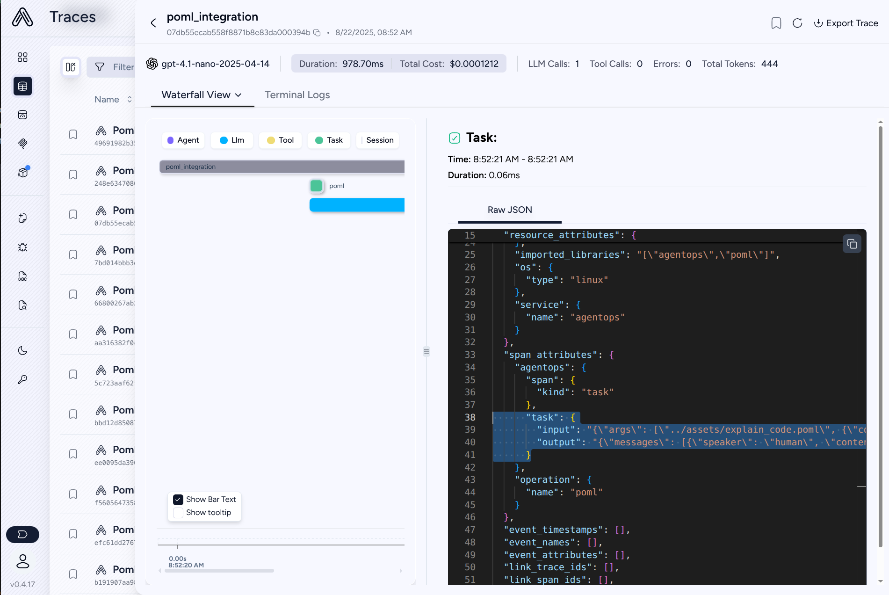

# AgentOps Integration

AgentOps is an observability platform designed for AI agents and LLM applications. The POML-AgentOps integration automatically traces your POML calls and sends them to AgentOps for monitoring, debugging, and analytics.



## Installation and Configuration

Install POML with AgentOps support:

```bash
pip install poml[agent]
```

Or install AgentOps separately:

```bash
pip install agentops
```

Set up your AgentOps API key as an environment variable:

```bash
export AGENTOPS_API_KEY="your-api-key-here"
```

You can obtain an API key from the [AgentOps dashboard](https://app.agentops.ai).

## Basic Usage

Enable POML tracing with AgentOps:

```python
import os
import poml
import agentops
from openai import OpenAI

# Initialize AgentOps. Trace is automatically started.
agentops.init()

# Enable POML tracing with AgentOps
poml.set_trace("agentops", trace_dir="pomlruns")

# Use POML as usual
client = OpenAI()
messages = poml.poml(
    "explain_code.poml",
    context={"code_path": "sample.py"},
    format="openai_chat"
)

response = client.chat.completions.create(
    model="gpt-5",
    **messages
)

# Trace ends automatically at the end of the script.
```

## What Gets Traced

When AgentOps integration is enabled, POML automatically captures POML Operations. Each POML call is logged as an operation with:

- **Operation Name**: "poml"
- **Prompt Content**: The raw POML source
- **Context Variables**: All context variables passed to the POML call
- **Stylesheet**: Any stylesheet configuration
- **Result**: The processed prompt structure sent to the LLM

### Example Trace Data

````json
{
  "resource_attributes": {
    "imported_libraries": "[\"agentops\",\"poml\"]"
  },
  "span_attributes": {
    "agentops": {
      "span": {
        "kind": "task"
      }
    },
    "task": {
      "input": "{\"args\": [\"../assets/explain_code.poml\", {\"code_path\": \"sample.py\"}, null], \"kwargs\": {}}",
      "output": "{\"messages\": [{\"speaker\": \"human\", \"content\": \"# Task\\n\\nYou are a senior Python developer. Please explain the code.\\n\\n```\\ndef greet(name):\\n    print(f\\\"Hello, {name}!\\\")\\n\\ndef add(a, b):\\n    return a + b\\n\\ndef factorial(n):\\n    if n == 0:\\n        return 1\\n    else:\\n        return n * factorial(n - 1)\\n\\ndef is_even(num):\\n    return num % 2 == 0\\n\\ndef main():\\n    greet(\\\"Alice\\\")\\n    x = 5\\n    y = 7\\n    print(f\\\"{x} + {y} = {add(x, y)}\\\")\\n    print(f\\\"Factorial of {x} is {factorial(x)}\\\")\\n    if is_even(x):\\n        print(f\\\"{x} is even\\\")\\n    else:\\n        print(f\\\"{x} is odd\\\")\\n\\nif __name__ == \\\"__main__\\\":\\n    main()\\n```\"}], \"runtime\": {\"temperature\": 0.7, \"maxTokens\": 256}}"
    },
    "operation": {
      "name": "poml"
    }
  }
}
````

## See Also

- [POML Tracing Guide](../trace.md)
- [AgentOps Documentation](https://docs.agentops.ai)
- [AgentOps Dashboard](https://app.agentops.ai)
