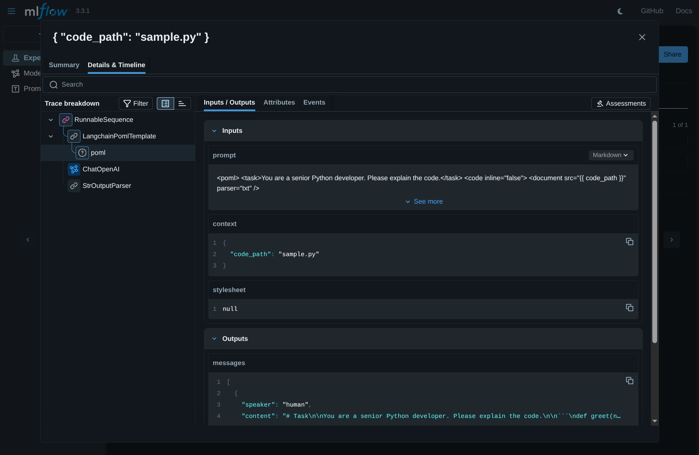
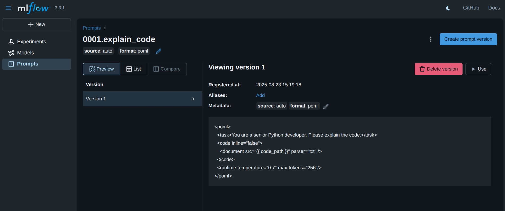

# MLflow Integration

MLflow is an open-source platform for managing the machine learning lifecycle, including experimentation, reproducibility, and deployment. The POML-MLflow integration automatically tracks your POML calls as MLflow traces and registers prompts in the MLflow prompt registry.



## Installation and Configuration

Install POML with MLflow support:

```bash
pip install poml[agent]
```

Or install MLflow separately:

```bash
pip install mlflow mlflow-genai
```

## Configuration

Set up MLflow tracking server (optional, defaults to local file store):

```bash
# Start a local MLflow tracking server
mlflow server --host 0.0.0.0 --port 5000

# Or use a remote tracking server
export MLFLOW_TRACKING_URI="http://your-mlflow-server:5000"
```

## Basic Usage

Enable POML tracing with MLflow:

```python
import mlflow
import mlflow.openai
import poml
from openai import OpenAI

# Set up MLflow experiment
mlflow.set_experiment("poml_integration")
mlflow.set_tracking_uri("http://localhost:5000")

# Enable POML tracing with MLflow
poml.set_trace("mlflow", trace_dir="pomlruns")

# Enable OpenAI autologging for tracing OpenAI API calls as well
mlflow.openai.autolog()

# Use POML as usual
client = OpenAI()
messages = poml.poml(
    "explain_code.poml", 
    context={"code_path": "sample.py"}, 
    format="openai_chat"
)

response = client.chat.completions.create(
    model="gpt-5",
    **messages
)
```

## What Gets Traced

When MLflow integration is enabled, POML automatically captures:

### POML Traces

Each POML call is logged as an MLflow trace with:

- **Trace Name**: "poml"
- **Prompt Content**: The raw POML source
- **Context Variables**: All context variables passed to the POML call
- **Stylesheet**: Any stylesheet configuration
- **Result**: The processed prompt structure sent to the LLM

### Prompt Registration

POML prompts are automatically registered in MLflow's prompt registry with:

- **Prompt Name**: Automatically derived from the POML filename and sequential number (e.g., `0001.explain_code`), see [trace documentation](../trace.md) for details
- **Template**: The complete POML source content
- **Version Control**: MLflow tracks prompt versions automatically



### Example Trace Data

```json
{
  "inputs": {
    "prompt": "<poml> <task>You are a senior Python developer. Please explain the code.</task> <code inline=\"false\"> <document src=\"{{ code_path }}\" parser=\"txt\" /> </code> <runtime temperature=\"0.7\" max-tokens=\"256\"/> </poml>",
    "context": {
      "code_path": "sample.py"
    },
    "stylesheet": null
  },
  "outputs": {
    "messages": [
      {
        "speaker": "human",
        "content": "# Task\n\nYou are a senior Python developer. Please explain the code.\n\n```\ndef greet(name):\n    print(f\"Hello, {name}!\")\n..."
      }
    ]
  }
}
```

## See Also

- [POML Tracing Guide](../trace.md)
- [MLflow Documentation](https://mlflow.org/docs/latest/)
- [MLflow Tracing Guide](https://mlflow.org/docs/latest/genai/tracing/)
- [MLflow Prompt Engineering](https://mlflow.org/docs/latest/genai/prompt-registry/prompt-engineering/)
