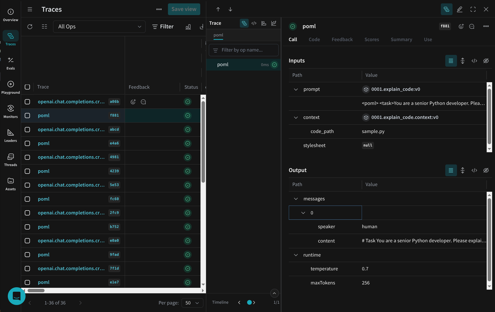
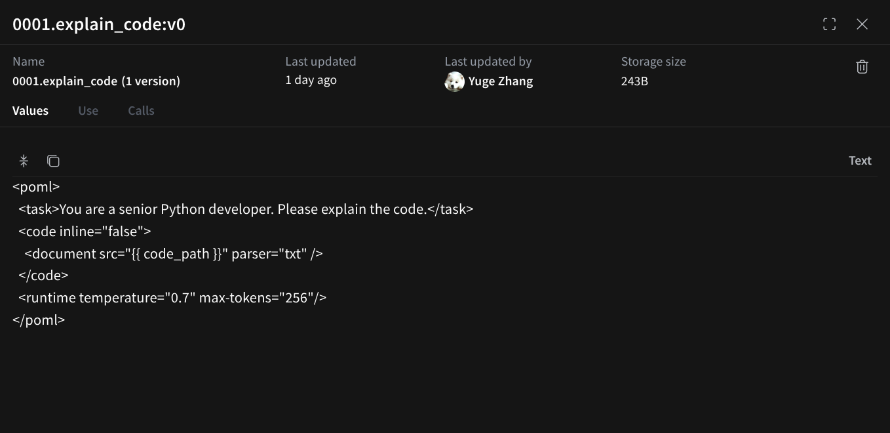

# Weave Integration

Weave is Weights & Biases' lightweight AI observability framework for tracking and versioning LLM applications. The POML-Weave integration automatically traces your POML calls and publishes prompts as versioned Weave objects.



## Installation and Configuration

Install POML with Weave support:

```bash
pip install poml[agent]
```

Or install Weave separately:

```bash
pip install weave
```

Set up your Weights & Biases API key:

```bash
export WANDB_API_KEY="your-api-key-here"
```

You can obtain an API key from [Weights & Biases](https://wandb.ai/settings).

## Basic Usage

Enable POML tracing with Weave:

```python
import poml
import weave
from openai import OpenAI

# Initialize Weave project
weave.init("my_poml_project")

# Enable POML tracing with Weave
poml.set_trace("weave", trace_dir="pomlruns")

# Use POML as usual
client = OpenAI()
messages = poml.poml(
    "explain_code.poml",
    context={"code_path": "sample.py"},
    format="openai_chat"
)

response = client.chat.completions.create(
    model="gpt-5",
    **messages
)
```

## What Gets Traced

When Weave integration is enabled, POML automatically captures:

### POML Operations

Each POML call is logged as a Weave operation with:

- **Operation Name**: "poml"
- **Prompt Content**: The raw POML source
- **Context Variables**: All context variables passed to the POML call
- **Stylesheet**: Any stylesheet configuration
- **Result**: The processed prompt structure sent to the LLM

### Prompt Publishing

POML prompts are automatically published as versioned Weave objects:

- **Object Name**: Automatically derived from the POML filename and sequential number (e.g., `0001.explain_code`), see [trace documentation](../trace.md) for details
- **Object Content**: The complete POML source template
- **Context Object**: Published separately as `{name}.context` if context is provided
- **Stylesheet Object**: Published separately as `{name}.stylesheet` if stylesheet is provided
- **Version Control**: Weave automatically versions all published objects



### Example Trace Data

````json
{
  "inputs": {
    "prompt": "weave://.../001.explain_code:v0",
    "context": "weave://.../0001.explain_code.context:v0",
    "stylesheet": null
  },
  "outputs": {
    "messages": [
      {
        "speaker": "human",
        "content": "# Task\n\nYou are a senior Python developer. Please explain the code.\n\n```\ndef greet(name):\n    print(f\"Hello, {name}!\")\n..."
      }
    ],
    "runtime": {
      "temperature": 0.7,
      "maxTokens": 256
    }
  }
}
````

## See Also

- [POML Tracing Guide](../trace.md)
- [Weave Documentation](https://docs.wandb.ai/guides/weave/)
- [Weights & Biases Platform](https://wandb.ai)
