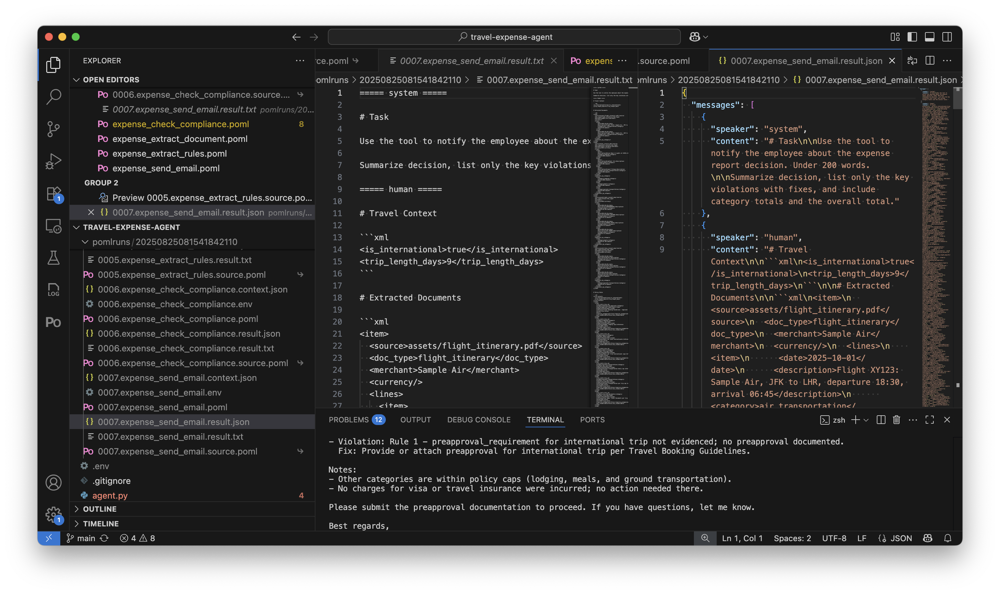
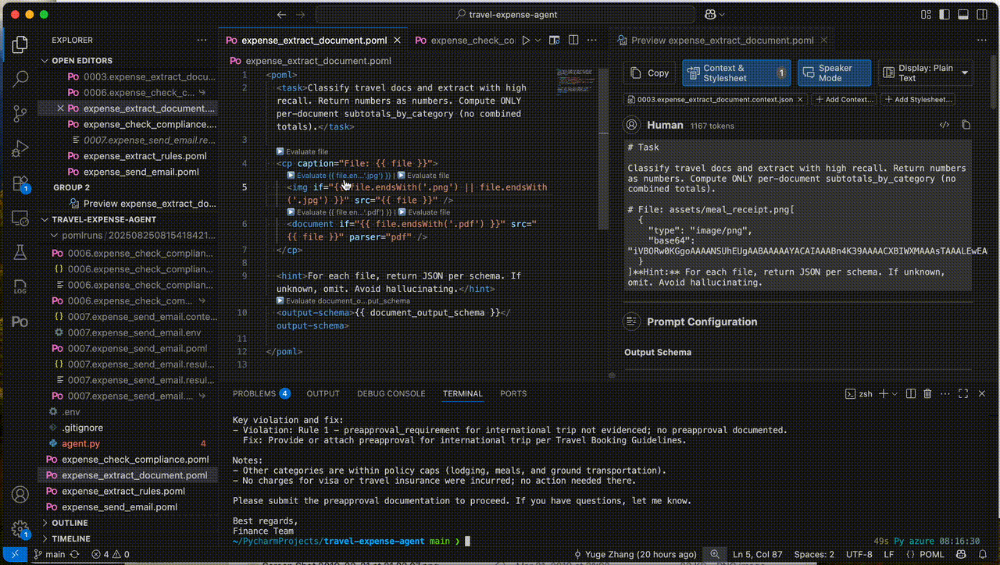
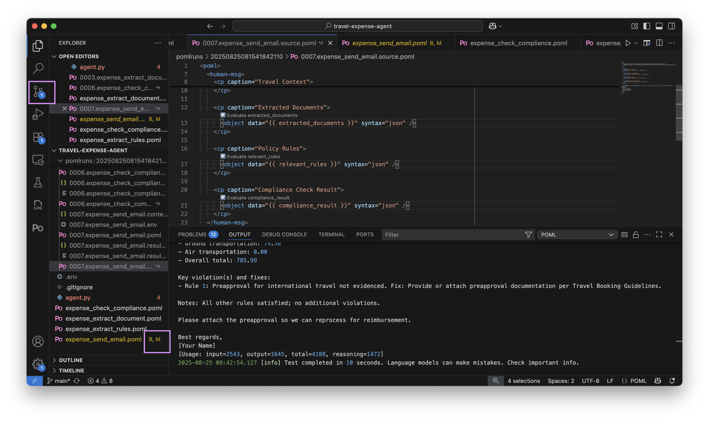

# Travel Expense Agent - Part 2: Debug Workflow with VS Code Extension

## Setup Tracing in Python


The tracing system captures detailed information about each step, making it easy to identify where improvements are needed. You can examine the exact prompts sent to the LLM, the responses received, and timing information for performance optimization.

When working with complex workflows like this, start by testing each step individually with known inputs. Once each step works reliably, test the complete pipeline. The structured data flow makes it easy to create test fixtures and verify outputs. ???
Setting up tracing helps you debug and improve your prompts over time:

```python
poml.set_trace(trace_dir="pomlruns")
```

This creates detailed logs of every interaction, which becomes invaluable as your system grows in complexity.



## Attach Context and Preview Rendering


If you have a paired `.context.json` file, you do not worry about loading and attaching context manually. The POML VS Code extension automatically detects and loads the context file.


The context json can be copied from the trace directory to your source code directory, so that you can have a stable sample context for prompt iteration and debugging.

## Local Template Debugging



## Test Individual Prompts

Debug one step rather than rerunning the entire workflow. Because all information including context and output schema can already captured, this can be done natively in VS Code without Python, with extra configuration.


Still remember to configure the LLM API keys in VS Code settings.


## Iterate and Improve



