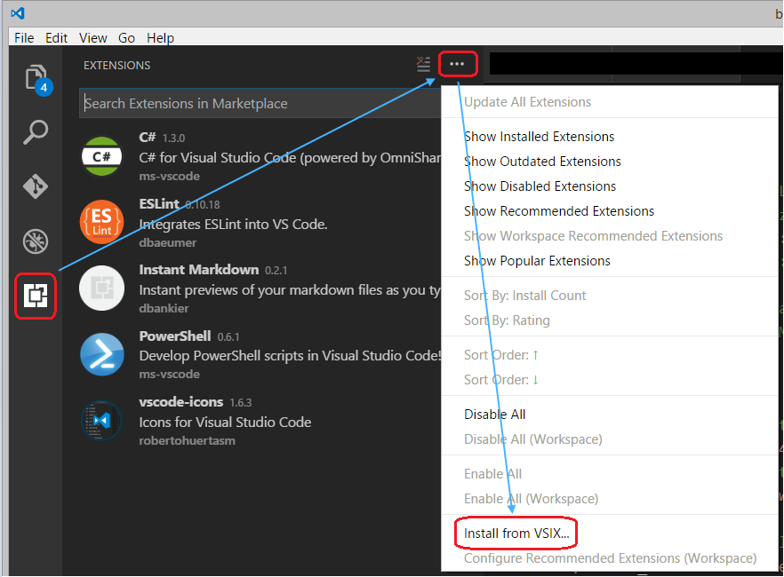

# POML Visual Code Extension

The POML Visual Studio Code extension provides comprehensive support for working with POML files.

## Features

- **Syntax Highlighting**: Full syntax highlighting for `.poml` files
- **IntelliSense**: Auto-completion and suggestions
- **Preview Panel**: Live preview of POML rendering
- **Model Testing**: Test prompts directly in VS Code
- **Gallery**: Built-in prompt gallery for common patterns

## Installation

### Stable Release

Install from [Visual Studio Code Marketplace](https://marketplace.visualstudio.com/items?itemName=poml-team.poml).

You can also install the extension manually by downloading the `.vsix` file from our [GitHub releases page](https://github.com/microsoft/poml/releases) and installing it in VS Code via the Extensions view.

### Nightly Build

Download the nightly build from this [index](https://poml-vscode-nightly.scottyugochang.workers.dev/)

Install the downloaded `.vsix` file in VS Code via the Extensions view (thanks [stackoverflow](https://stackoverflow.com/questions/42017617/how-to-install-vs-code-extension-manually) for the image below).

Before testing prompts with the POML toolkit, make sure you have configured your preferred LLM model, API key, and endpoint. If these are not set, prompt testing will not work. [Configuration instructions](./configuration.md).
